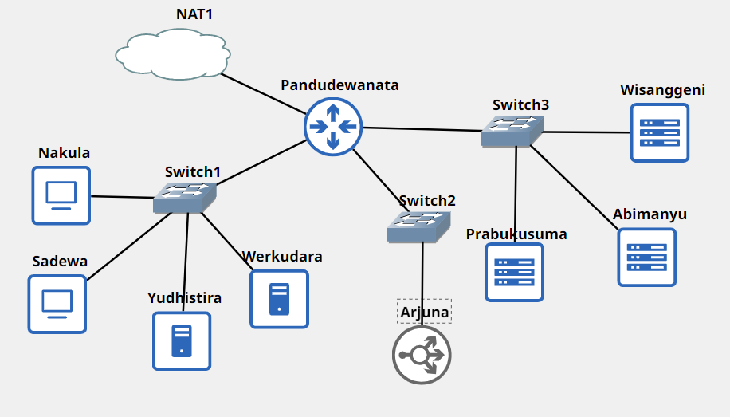

# Jarkom-Modul-2-F13-2022

| **No** | **Nama**                         | **NRP**    |
| ------ | -------------------------------- | ---------- |
| 1      | Helmi Abiyu Mahendra             | 5025211061 |
| 2      | Muhammad Naufal Fawwaz Ramadhan  | 5025211223 |


--------------------------------

## Soal 1
Yudhistira akan digunakan sebagai DNS Master, Werkudara sebagai DNS Slave, Arjuna merupakan Load Balancer yang terdiri dari beberapa Web Server yaitu Prabakusuma, Abimanyu, dan Wisanggeni. Buatlah topologi dengan pembagian sebagai berikut. Folder topologi dapat diakses pada drive berikut 
<hr style="width:60%;text-align:center">



Konfigurasi setiap node sebagai berikut:
Router: 
 - **Pandudewanata**
    ```
   auto eth0
   iface eth0 inet dhcp

    auto eth1
    iface eth1 inet static
	address 10.58.1.1
	netmask 255.255.255.0

    auto eth2
    iface eth2 inet static
	address 10.58.2.1
	netmask 255.255.255.0

    auto eth3
    iface eth3 inet static
	address 10.58.3.1
	netmask 255.255.255.0
    ```

Client:
 - **Sadewa**
    ```
    auto eth0
    iface eth0 inet static
	address 10.58.1.3
	netmask 255.255.255.0
	gateway 10.58.1.1
    ```
 - **Nakula**
    ```
    auto eth0
    iface eth0 inet static
	address 10.58.1.2
	netmask 255.255.255.0
	gateway 10.58.1.1
    ```

DNS Server:
 - **Yudhistira**
    ```
    auto eth0
    iface eth0 inet static
	address 10.58.1.4
	netmask 255.255.255.0
	gateway 10.58.1.1
    ```
 - **Werkudara**
    ```
    auto eth0
    iface eth0 inet static
	address 10.58.1.5
	netmask 255.255.255.0
	gateway 10.58.1.1
    ```

Load Balancer:
 - **Arjuna**
    ```
    auto eth0
    iface eth0 inet static
	address 10.58.2.2
	netmask 255.255.255.0
	gateway 10.58.2.1
    ```

Web Server:
 - **Prabukusuma**
    ```
   auto eth0
    iface eth0 inet static
	address 10.58.3.4
	netmask 255.255.255.0
	gateway 10.58.3.1
    ```
 - **Wisanggeni**
    ```
    auto eth0
    iface eth0 inet static
	address 10.58.3.2
	netmask 255.255.255.0
	gateway 10.58.3.1
    ```
 - **Abimanyu**
    ```
    auto eth0
    iface eth0 inet static
	address 10.58.3.3
	netmask 255.255.255.0
	gateway 10.58.3.1
    ```


## Soal 2
Buatlah website utama pada node arjuna dengan akses ke arjuna.f13.com dengan alias www.arjuna.f13.com dengan f13 merupakan kode kelompok.
### Script Solution
- Node Yudhistira

```sh
echo 'zone "arjuna.f13.com" {
        type master;
        file "/etc/bind/praktikum-jarkom/arjuna.f13.com";
};'

mkdir /etc/bind/praktikum-jarkom

echo "
\$TTL    604800
@       IN      SOA     arjuna.f13.com. root.arjuna.f13.com. (
                        2023101101      ; Serial
                        604800          ; Refresh
                        86400           ; Retry
                        2419200         ; Expire
                        604800 )        ; Negative Cache TTL
;
@               IN      NS      arjuna.f13.com.
@               IN      A       10.58.2.2 ; IP Arjuna
www             IN      CNAME   arjuna.f13.com.
" > /etc/bind/praktikum-jarkom/arjuna.f13.com

service bind9 restart
```

Setelah itu melakukan *setup* yaitu menghapus *namserver 192.168.122.1* atau *nameserver router* dan menambahkan *nameserver IP Node Yudhistira* dalam file **/etc/resolv.conf** pada *Node Client* (Nakula / Sadewa) seperti berikut :

```
nameserver 10.58.1.4
```

Dan setelah itu dapat dibuktikan dengan melakukan **Ping** dan `host` melalui **CNAME** pada domain yang telah dibuat 

```sh
ping arjuna.f13.com -c 3
ping www.arjuna.f13.com -c 3
host -t CNAME www.arjuna.f13.com
```

### Test Result
Test tanpa **www**
 

Test menggunakan **www**
 

Test Alias dari **www**
 


## Soal 3
Dengan cara yang sama seperti soal nomor 2, buatlah website utama dengan akses ke abimanyu.f13.com dan alias www.abimanyu.f13.com.

## Soal 4
Kemudian, karena terdapat beberapa web yang harus di-deploy, buatlah subdomain parikesit.abimanyu.f13.com yang diatur DNS-nya di Yudhistira dan mengarah ke Abimanyu.
### Script Solution
- Node Yudhistira

```sh
echo "
\$TTL    604800
@       IN      SOA     abimanyu.f13.com. root.abimanyu.f13.com. (
                        2023101101      ; Serial
                        604800          ; Refresh
                        86400           ; Retry
                        2419200         ; Expire
                        604800 )        ; Negative Cache TTL
;
@               IN      NS      abimanyu.f13.com.
@               IN      A       10.58.3.3 ; IP Abimanyu
www             IN      CNAME   abimanyu.f13.com.
parikesit       IN      A       10.58.3.3 ; IP Abimanyu
" > /etc/bind/praktikum-jarkom/abimanyu.f13.com

service bind9 restart
```

Setelah itu, langkah selanjutnya masih sama dengan *Question 2 / 3*, yaitu langsung dibuktikan melalui **Ping**

```sh
ping parikesit.abimanyu.f13.com -c 3
```

### Test Result


## Soal 5
Buat juga reverse domain untuk domain utama. (Abimanyu saja yang direverse)
### Script Solution

Setelah mengetahui IP dari *Node* Abimanyu, kita perlu mengedit file **/etc/bind/named.conf.local** dengan menambahkan 3 byte awal dari IP *Node* Abimanyu seperti berikut
- Node Yudhistira

```sh
echo 'zone "3.55.10.in-addr.arpa" { 
        type master;
        file "/etc/bind/praktikum-jarkom/3.55.10.in-addr.arpa";
};' > /etc/bind/named.conf.local
```

Dan dilanjut dengan meng-copy file **db.local** ke-dalam folder **praktikum-jarkom** dan merubah namanya menjadi **/etc/bind/jarkom/3.55.10.in-addr.arpa**. Setlah itu mengeditnya menjadi seperti berikut 

```sh
echo "
\$TTL    604800
@       IN      SOA     abimanyu.f13.com. root.abimanyu.f13.com. (
                        2023101101      ; Serial
                        604800          ; Refresh
                        86400           ; Retry
                        2419200         ; Expire
                        604800 )        ; Negative Cache TTL
;
3.55.10.in-addr.arpa.   IN      NS      abimanyu.f13.com.
3                       IN      PTR     abimanyu.f13.com.
" > /etc/bind/praktikum-jarkom/3.55.10.in-addr.arpa

service bind9 restart
```

Untuk mengecek apakah konfigurasi sudah benar atau belum, lakukan perintah berikut 

```sh
apt-get update
apt-get install dnsutils
```

Pastikan nameserver di **/etc/resolv.conf** pada *Node Yudhistira* telah dikembalikan sama dengan nameserver dari **Pandudewanata** 

Setelah itu, testing dapat dilakukan sama seperti pada *Question 2 / 3 / 4* yaitu pada *Node Client* dengan memasukkan command berikut

```sh
host -t PTR 10.58.3.3
```

### Test Result


## Soal 6
Agar dapat tetap dihubungi ketika DNS Server Yudhistira bermasalah, buat juga Werkudara sebagai DNS Slave untuk domain utama.
### Script Solution
Langkah awal adalah menambahkan *nofity, also-notify dan allow-transfer* agar memberikan izin kepada *IP* yang dituju
- Node Yudhistira

```sh
echo 'zone "arjuna.f13.com" {
        type master;
        notify yes;
        also-notify { 10.58.1.5; }; // IP Werkudara
        allow-transfer { 10.58.1.5; }; // IP Werkudara
        file "/etc/bind/praktikum-jarkom/arjuna.f13.com";
};

zone "abimanyu.f13.com" {
        type master;
        notify yes;
        also-notify { 10.58.1.5; }; // IP Werkudara
        allow-transfer { 10.58.1.5; }; // IP Werkudara
        file "/etc/bind/praktikum-jarkom/abimanyu.f13.com";
};

zone "3.55.10.in-addr.arpa" { 
        type master;
        file "/etc/bind/praktikum-jarkom/3.55.10.in-addr.arpa";
};' > /etc/bind/named.conf.local

service bind9 restart
service bind9 stop // Stop untuk testing Slave
```

- Node Werkudara (Slave)

Membuat **type slave** pada zone dari *domain* dan mengubah *path file*

```sh
echo 'zone "arjuna.f13.com" {
        type slave;
        masters { 10.58.1.4; }; // IP Yudhistira
        file "/var/lib/bind/arjuna.f13.com";
};

zone "abimanyu.f13.com" {
        type slave;
        masters { 10.58.1.4; }; // IP Yudhistira
        file "/var/lib/bind/abimanyu.f13.com";
};' > /etc/bind/named.conf.local

service bind9 restart
```

Setelah itu, untuk membuktikan *Slave* berhasil atau tidak, perlu ditambahkan `IP Werkudara` pada **/etc/resolv.conf** didalam *Node Client*
```
nameserver 10.58.1.5
```

Jika sudah, testing dapat dilakukan dengan melakukan **Ping** pada domain yang telah dibuat seperti `Arjuna` dan `Abimanyu`

```sh
ping arjuna.f13.com -c 3
ping abimanyu.f13.com -c 3
```

### Test Result
Start bind9 **Werkudara**
 

Stop bind9 **Yudhistira**
 

Test domain **Arjuna**
 

Test domain **Abimanyu**
 


## Soal 7
Seperti yang kita tahu karena banyak sekali informasi yang harus diterima, buatlah subdomain khusus untuk perang yaitu baratayuda.abimanyu.f13.com dengan alias www.baratayuda.abimanyu.f13.com yang didelegasikan dari Yudhistira ke Werkudara dengan IP menuju ke Abimanyu dalam folder Baratayuda.

## Soal 8
Untuk informasi yang lebih spesifik mengenai Ranjapan Baratayuda, buatlah subdomain melalui Werkudara dengan akses rjp.baratayuda.abimanyu.f13.com dengan alias www.rjp.baratayuda.abimanyu.f13.com yang mengarah ke Abimanyu.
### Script Solution
Langkah yang dilakukan yaitu perlu untuk melakukan penambahan pada `Werkudara / DNS Slave` sebagai berikut
```
rjp             IN      A       10.58.3.3     ; IP Abimanyu
www.rjp         IN      CNAME   rjp.baratayuda.abimanyu.f13.com.
```

- Node Werkudara

```sh
echo '
$TTL    604800
@       IN      SOA     baratayuda.abimanyu.f13.com. root.baratayuda.abimanyu.f13.com. (
                        2023101101      ; Serial
                        604800          ; Refresh
                        86400           ; Retry
                        2419200         ; Expire
                        604800 )        ; Negative Cache TTL
;
@               IN      NS      baratayuda.abimanyu.f13.com.
@               IN      A       10.58.3.3       ; IP Abimanyu
www             IN      CNAME   baratayuda.abimanyu.f13.com.
rjp             IN      A       10.58.3.3       ; IP Abimanyu
www.rjp         IN      CNAME   rjp.baratayuda.abimanyu.f13.com.
' > /etc/bind/Baratayuda/baratayuda.abimanyu.f13.com

service bind9 restart
```

Setelah berhasil ditambahkan dan restart bind9, untuk melakukan testing cukup dengan melakukan **Ping** pada `rjp.baratayuda.abimanyu.f13.com` atau `www.rjp.baratayuda.abimanyu.f13.com` dan juga Alias dapat dilihat dengan menjalankan **CNAME**

```sh
ping rjp.baratayuda.abimanyu.f13.com -c 3
ping www.rjp.baratayuda.abimanyu.f13.com -c 3
host -t CNAME www.rjp.baratayuda.abimanyu.f13.com
```

### Test Result
Test tanpa **www**
 

Test menggunakan **www**
  

Test Alias dari **www**
 

## Soal 9
Arjuna merupakan suatu Load Balancer Nginx dengan tiga worker (yang juga menggunakan nginx sebagai webserver) yaitu Prabakusuma, Abimanyu, dan Wisanggeni. Lakukan deployment pada masing-masing worker.

## Soal 10
Kemudian gunakan algoritma Round Robin untuk Load Balancer pada Arjuna. Gunakan server_name pada soal nomor 1. Untuk melakukan pengecekan akses alamat web tersebut kemudian pastikan worker yang digunakan untuk menangani permintaan akan berganti ganti secara acak. Untuk webserver di masing-masing worker wajib berjalan di port 8001-8003. Contoh
    - Prabakusuma:8001
    - Abimanyu:8002
    - Wisanggeni:8003
### Script Solution
Untuk load balancer Arjuna, dapat mengubah konfigurasinya menjadi seperti berikut ini. Disini ditambahkan `:800N` pada setiap baris server worker-nya, dengan N merupakan angka 1 hingga 3 untuk membedakan port pada setiap workernya.

```sh
echo '
 upstream myweb  {
 	server 10.58.3.2:8001; #IP Prabakusuma
 	server 10.58.3.3:8002; #IP Abimanyu
 	server 10.58.3.4:8003; #IP Wisanggeni
 }

 server {
 	listen 80;
 	server_name arjuna.f13.com;

 	location / {
 	proxy_pass http://myweb;
 	}
 }
' > /etc/nginx/sites-available/lb-arjuna.f13
ln -s /etc/nginx/sites-available/lb-arjuna.f13 /etc/nginx/sites-enabled
service nginx restart
```

Adapun untuk worker-nya, terdapat tambahan keterangan terkait port yang digunakan. Pada konfigurasi ini, dapat dilihat pada baris `listen 800N`, dimana N merupakan angka menyesuaikan dengan masing-masing port worker. Disini juga ditambahkan satu perintah `echo` (echo yang ketiga) yang menampilkan pesan tambahan terkait port yang digunakan oleh setiap worker.

```sh
echo '
 <?php
  echo "Halo, Kamu berada di [Nama Worker]";
 ?>
' > /var/www/praktikum-jarkom/index.php

echo '
server {

 	listen 800N;

 	root /var/www/praktikum-jarkom;

 	index index.php index.html index.htm;
 	server_name _;

 	location / {
 			try_files $uri $uri/ /index.php?$query_string;
 	}

 	# pass PHP scripts to FastCGI server
 	location ~ \.php$ {
 	include snippets/fastcgi-php.conf;
 	fastcgi_pass unix:/var/run/php/php7.0-fpm.sock;
 	}

location ~ /\.ht {
 			deny all;
 	}

 	error_log /var/log/nginx/arjuna.f13_error.log;
 	access_log /var/log/nginx/arjuna.f13_access.log;
 }
' > /etc/nginx/sites-available/arjuna.f13

nginx_port=$(awk '/listen/ {print $2}' /etc/nginx/sites-available/arjuna.f13)
echo "
 <?php
  echo ',tepatnya di port : $nginx_port'
 ?>
" >> /var/www/praktikum-jarkom/index.php

service php7.0-fpm start
rm /etc/nginx/sites-enabled/default
service nginx restart
```

### Test Result
Lakukan pengujian pada node client seperti Nakula. Tuliskan perintah berikut
 

Hasil menampilkan Prabakusuma
 

Hasil menampilkan Abimanyu
 

Hasil menampilkan Wisanggeni
 
## Soal 11
Selain menggunakan Nginx, lakukan konfigurasi Apache Web Server pada worker Abimanyu dengan web server www.abimanyu.f13.com. Pertama dibutuhkan web server dengan DocumentRoot pada /var/www/abimanyu.f13

## Soal 12
Setelah itu ubahlah agar url www.abimanyu.f13.com/index.php/home menjadi www.abimanyu.f13.com/home.
### Script Solution
- Node Abimanyu

```sh
echo -e '<VirtualHost *:80>
  ServerAdmin webmaster@localhost
  DocumentRoot /var/www/abimanyu.f13
  ServerName abimanyu.f13.com
  ServerAlias www.abimanyu.f13.com

  <Directory /var/www/abimanyu.f13/index.php/home>
          Options +Indexes
  </Directory>

  Alias "/home" "/var/www/abimanyu.f13/index.php/home"

  ErrorLog ${APACHE_LOG_DIR}/error.log
  CustomLog ${APACHE_LOG_DIR}/access.log combined
</VirtualHost>' > /etc/apache2/sites-available/abimanyu.f13.com.conf

service apache2 restart
```

Setelah itu, lakukan testing dengan menjalankan command berikut pada *Node Client*

```sh
lynx abimanyu.f13.com/home
```

### Test Result


## Soal 13
Selain itu, pada subdomain www.parikesit.abimanyu.f13.com, DocumentRoot disimpan pada /var/www/parikesit.abimanyu.f13

## Soal 14
Pada subdomain tersebut folder /public hanya dapat melakukan directory listing sedangkan pada folder /secret tidak dapat diakses (403 Forbidden).
### Script Solution
- Node Abimanyu

```sh
echo -e '<VirtualHost *:80>
  ServerAdmin webmaster@localhost
  DocumentRoot /var/www/parikesit.abimanyu.f13
  ServerName parikesit.abimanyu.f13.com
  ServerAlias www.parikesit.abimanyu.f13.com

  <Directory /var/www/parikesit.abimanyu.f13/public>
          Options +Indexes
  </Directory>

  <Directory /var/www/parikesit.abimanyu.f13/secret>
          Options -Indexes
  </Directory>

  Alias "/public" "/var/www/parikesit.abimanyu.f13/public"
  Alias "/secret" "/var/www/parikesit.abimanyu.f13/secret"

  ErrorLog ${APACHE_LOG_DIR}/error.log
  CustomLog ${APACHE_LOG_DIR}/access.log combined
</VirtualHost>' > /etc/apache2/sites-available/parikesit.abimanyu.f13.com.conf

service apache2 restart
```

Setelah itu, untuk membuktikan nya cukup dengan memasukkan command berikut pada *Node Client*

```sh
lynx parikesit.abimanyu.f13.com/public
lynx parikesit.abimanyu.f13.com/secret
```

### Test Result
Test **public**


Test **secret**


Laman **secret** setelah *alert*


## Soal 15
Buatlah kustomisasi halaman error pada folder /error untuk mengganti error kode pada Apache. Error kode yang perlu diganti adalah 404 Not Found dan 403 Forbidden.

## Soal 16
Buatlah suatu konfigurasi virtual host agar file asset www.parikesit.abimanyu.f13.com/public/js menjadi 
www.parikesit.abimanyu.f13.com/js 
### Script Solution
Pada file `parikesit.abimanyu.f13.com.conf` tambahkan baris `Alias "/js" "/var/www/parikesit.abimanyu.f13/public/js"` seperti ini

```sh
echo -e '<VirtualHost *:80>
  ServerAdmin webmaster@localhost
  DocumentRoot /var/www/parikesit.abimanyu.f13
  ServerName parikesit.abimanyu.f13.com
  ServerAlias www.parikesit.abimanyu.f13.com

  <Directory /var/www/parikesit.abimanyu.f13/public>
          Options +Indexes
  </Directory>

  <Directory /var/www/parikesit.abimanyu.f13/secret>
          Options -Indexes
  </Directory>

  Alias "/public" "/var/www/parikesit.abimanyu.f13/public"
  Alias "/secret" "/var/www/parikesit.abimanyu.f13/secret"
  Alias "/js" "/var/www/parikesit.abimanyu.f13/public/js"

  ErrorDocument 404 /error/404.html
  ErrorDocument 403 /error/403.html

  ErrorLog ${APACHE_LOG_DIR}/error.log
  CustomLog ${APACHE_LOG_DIR}/access.log combined
</VirtualHost>' > /etc/apache2/sites-available/parikesit.abimanyu.f13.com.conf
```
Setelah itu lakukan perintah `service apache2 restart`

### Test Result
Ketika dilakukan pengujian pada client node Nakula,


Diperoleh hasil yang sama ketika mengakses `www.parikesit.abimanyu.f13.com/public/js`, yaitu sebagai berikut


## Soal 17
Agar aman, buatlah konfigurasi agar www.rjp.baratayuda.abimanyu.f13.com hanya dapat diakses melalui port 14000 dan 14400.

## Soal 18
Untuk mengaksesnya buatlah autentikasi username berupa “Wayang” dan password “baratayudaf13” dengan f13 merupakan kode kelompok. Letakkan DocumentRoot pada /var/www/rjp.baratayuda.abimanyu.f13.
### Script Solution
Untuk konfigurasinya adalah sebagai berikut

```sh
echo -e '<VirtualHost *:14000 *:14400>
  ServerAdmin webmaster@localhost
  DocumentRoot /var/www/rjp.baratayuda.abimanyu.f13
  ServerName rjp.baratayuda.abimanyu.f13.com
  ServerAlias www.rjp.baratayuda.abimanyu.f13.com

  <Directory /var/www/rjp.baratayuda.abimanyu.f13>
          AuthType Basic
          AuthName "Restricted Content"
          AuthUserFile /etc/apache2/.htsecure
          Require valid-user
  </Directory>

  ErrorDocument 404 /error/404.html
  ErrorDocument 403 /error/403.html

  ErrorLog ${APACHE_LOG_DIR}/error.log
  CustomLog ${APACHE_LOG_DIR}/access.log combined
</VirtualHost>' > /etc/apache2/sites-available/rjp.baratayuda.abimanyu.f13.com.conf
```

Setelah itu, dapat menjalankan perintah berikut

```sh
htpasswd -c -b /etc/apache2/.htsecure Wayang baratayudaf13
```

dimana `-c` berarti `created`, `-b` berarti fungsi `bcrypt` untuk mengubah password menjadi sebuah hash. Lalu `Wayang` sebagai username dan `baratayudaf13` sebagai password. Setelah itu lakukan aktivasi dan restart apache2 server.

```sh
a2ensite rjp.baratayuda.abimanyu.f13.com.conf
service apache2 restart
```

### Test Result
Untuk pengujian, dapat kembali mengakses `lynx rjp.baratayuda.abimanyu.f13.com:14000` atau `lynx rjp.baratayuda.abimanyu.f13.com:14400` pada node client Nakula


setelah itu akan muncul pesan peringatan, yang dilanjutkan dengan tampilan untuk mengisikan username dan password autentikasi


Setelah mengisikan username `Wayang` dan password `baratayudaf13`, diperoleh hasil sebagai berikut

## Soal 19
Buatlah agar setiap kali mengakses IP dari Abimanyu akan secara otomatis dialihkan ke www.abimanyu.f13.com (alias)

## Soal 20
Karena website www.parikesit.abimanyu.f13.com semakin banyak pengunjung dan banyak gambar gambar random, maka ubahlah request gambar yang memiliki substring “abimanyu” akan diarahkan menuju abimanyu.png.
### Script Solution
Berikut konfigurasinya

Pertama, kita perlu menjalankan perintah

```sh
a2enmod rewrite
```

Setelah itu, kita menjalankan pengaturan untuk ketentuan `Rewrite`-nya.

```sh
echo 'RewriteEngine On
RewriteCond %{REQUEST_URI} ^/public/images/(.*)(abimanyu)(.*\.(png|jpg))
RewriteCond %{REQUEST_URI} !/public/images/abimanyu.png
RewriteRule abimanyu http://parikesit.abimanyu.f13.com/public/images/abimanyu.png$1 [L,R=301]' > /var/www/parikesit.abimanyu.f13/.htaccess
```

Berikut keterangan terkait konfigurasi kode di atas

`RewriteEngine On`: Ini mengaktifkan mod_rewrite untuk server web. Tanpa baris ini, aturan pemetaan ulang URL tidak akan diterapkan.

`RewriteCond %{REQUEST_URI} ^/public/images/(.*)(abimanyu)(.*\.(png|jpg))`: Ini adalah kondisi pertama yang memeriksa apakah URL memenuhi pola tertentu. Kondisi ini memeriksa apakah URL dimulai dengan /public/images/ diikuti oleh teks apa pun, kemudian abimanyu, kemudian teks lagi, dan diakhiri dengan .png atau .jpg.

`RewriteCond %{REQUEST_URI} !/public/images/abimanyu.png`: Ini adalah kondisi kedua yang memeriksa apakah URL tidak mengarah ke /public/images/abimanyu.png. Ini dirancang untuk mencegah aturan rewrite diterapkan jika URL sudah mengarah ke gambar abimanyu.png.

`RewriteRule abimanyu http://parikesit.abimanyu.f13.com/public/images/abimanyu.png$1 [L,R=301]`: Aturan pemetaan ulang ini digunakan ketika kedua kondisi di atas terpenuhi. Aturan ini akan mengarahkan URL yang memenuhi pola tersebut ke **http://parikesit.abimanyu.f13.com/public/images/abimanyu.png**, menambahkan apapun yang cocok dengan (.*) pada URL target.

Setelah itu terdapat konfigurasi *virtual host* sebagai berikut

```sh
echo -e '<VirtualHost *:80>
  ServerAdmin webmaster@localhost
  DocumentRoot /var/www/parikesit.abimanyu.f13

  ServerName parikesit.abimanyu.f13.com
  ServerAlias www.parikesit.abimanyu.f13.com

  <Directory /var/www/parikesit.abimanyu.f13/public>
          Options +Indexes
  </Directory>

  <Directory /var/www/parikesit.abimanyu.f13/secret>
          Options -Indexes
  </Directory>

  <Directory /var/www/parikesit.abimanyu.f13>
          Options +FollowSymLinks -Multiviews
          AllowOverride All
  </Directory>

  Alias "/public" "/var/www/parikesit.abimanyu.f13/public"
  Alias "/secret" "/var/www/parikesit.abimanyu.f13/secret"
  Alias "/js" "/var/www/parikesit.abimanyu.f13/public/js"

  ErrorDocument 404 /error/404.html
  ErrorDocument 403 /error/403.html

  ErrorLog ${APACHE_LOG_DIR}/error.log
  CustomLog ${APACHE_LOG_DIR}/access.log combined
</VirtualHost>' > /etc/apache2/sites-available/parikesit.abimanyu.f13.com.conf
```

Terakhir, jalankan perintah berikut

```sh
a2enmod rewrite
service apache2 restart
```

### Test Result
Untuk pengujian dapat dilakukan sebagai berikut, dimana kita mencoba menjalankan perintah `lynx` yang diikuti `parikesit.abimanyu.f13.com/public/images/` lalu disertai nama file. Nama file disini dapat berupa gambar, dll. Konfigurasi `Rewrite` akan melakukan penyaringan seperti ketentuan kondisi di atas.

Diperoleh hasil sebagai berikut

Jika dilakukan percobaan dengan tidak sesuai ketentuan, misalnya pada percobaan terakhir yaitu `lynx parikesit.abimanyu.f13.com/public/images/notabimanyujustmuseum.177013`, maka akan diperoleh hasil sebagai berikut
